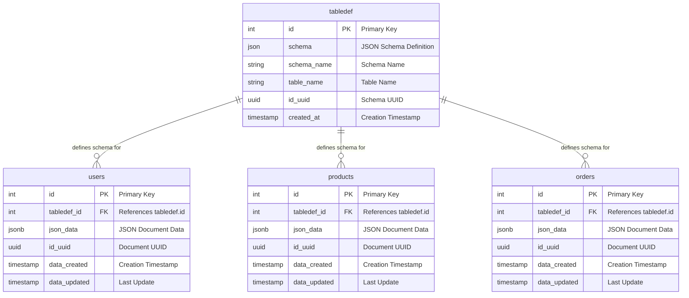
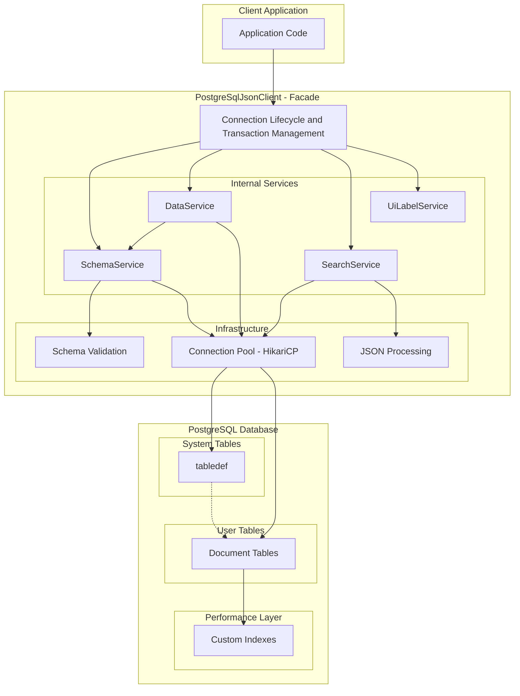

# PgJson Library
A high-performance Java library for document-oriented JSON data storage and retrieval using PostgreSQL. This library provides a comprehensive solution for storing, indexing, and querying JSON documents with schema validation and advanced search capabilities.

## Why This Library?

This library enables document-oriented data storage on PostgreSQL where each JSON object stored in one row represents a single data entry. Key benefits include:

- **Document-Oriented Storage**: Store complex JSON documents with full schema validation
- **Advanced Indexing**: Support for exact match, full-text search, object, and nested object indexes
- **Schema Validation**: JSON Schema 2020-12 validation with PgJson vocabulary extensions for data integrity
- **Flexible Querying**: Complex search operations with logical operators (AND/OR)
- **Performance Optimized**: Leverages PostgreSQL's native JSONB capabilities and indexing
- **Connection Pooling**: Built-in HikariCP connection pooling for high-performance applications
- **Document-Oriented Design**: Pure document storage without cross-table relationships

## Quick Start

### Prerequisites
- **Java 25** or higher
- **PostgreSQL 12** or higher
- **Maven** or **Gradle**

### Add Dependency

#### Maven
```xml
<dependency>
    <groupId>io.github.deltatango</groupId>
    <artifactId>pgjson</artifactId>
    <version>26.2.2</version>
</dependency>
```

#### Gradle
```gradle
implementation 'io.github.deltatango:pgjson:26.2.2'
```

### Basic Example

```java
import io.github.deltatango.pgjson.PostgreSqlJsonClient;
import io.github.deltatango.pgjson.model.DatabaseEntry;
import io.github.deltatango.pgjson.model.operations.OperationResult;
import io.github.deltatango.pgjson.model.operations.Result;
import java.util.Properties;
import java.util.List;

public class PgJsonExample {
    public static void main(String[] args) {
        // Configure database connection
        Properties props = new Properties();
        props.setProperty("jdbcUrl", "jdbc:postgresql://localhost:5432/mydb");
        props.setProperty("dataSource.user", "username");
        props.setProperty("dataSource.password", "password");
        
        try (PostgreSqlJsonClient client = new PostgreSqlJsonClient(props)) {
            // Insert a user document
            String userJson = "{\"name\": \"John Doe\", \"email\": \"john@example.com\", \"age\": 30}";
            OperationResult<Result> insertOp = client.insertData("users", userJson);
            Result result = insertOp.getOrThrow();
            System.out.println("User inserted: " + result.getResultStatus());
            
            // Search for users
            String searchJson = "{\"limit\": 10, \"offset\": 0, \"searchTerm\": {\"name\": \"John\"}}";
            OperationResult<List<DatabaseEntry>> searchOp = client.selectData("users", searchJson);
            List<DatabaseEntry> users = searchOp.getOrThrow();
            System.out.println("Found " + users.size() + " users");
            
            // Display results
            for (DatabaseEntry user : users) {
                System.out.println("User: " + user.getJsonData());
            }
        } catch (Exception e) {
            System.err.println("Error: " + e.getMessage());
        }
    }
}
```

### First Steps

#### Step 1: Understand JSON Schema (Foundation)
Before using this library, you need to understand **JSON Schema** - the foundation that defines your document structure and validation rules.

**What is JSON Schema?**
JSON Schema is a vocabulary that allows you to annotate and validate JSON documents. It defines the structure, data types, and constraints for your JSON data.

**Basic JSON Schema Structure:**
```json
{
  "$schema": "https://json-schema.org/draft/2020-12/schema",
  "type": "object",
  "required": ["name", "email"],
  "properties": {
    "name": {
      "type": "string",
      "description": "User's full name"
    },
    "email": {
      "type": "string",
      "format": "email",
      "description": "User's email address"
    },
    "age": {
      "type": "integer",
      "minimum": 0,
      "maximum": 150,
      "description": "User's age in years"
    }
  }
}
```

**Key JSON Schema Concepts:**
- **`type`**: Defines the data type (`string`, `number`, `integer`, `boolean`, `object`, `array`)
- **`required`**: Lists mandatory fields
- **`properties`**: Defines the structure of object fields
- **`format`**: Adds validation rules (email, date, etc.)
- **`minimum`/`maximum`**: Sets value constraints

**PgJson Vocabulary Extensions:**
This library extends JSON Schema with PostgreSQL-specific metadata:
```json
{
  "properties": {
    "name": {
      "type": "string",
      "x-pgjson-index": "fts",           // Full-text search index
      "x-pgjson-uiLabel": {             // Multi-language labels
        "en": "Full Name",
        "es": "Nombre Completo"
      }
    },
    "email": {
      "type": "string",
      "x-pgjson-index": "exact"          // Exact match index
    }
  }
}
```

**Index Types:**
- **`exact`**: For exact value matching (primary keys, enums)
- **`fts`**: For full-text search (content, descriptions)
- **`object`**: For complex object queries
- **`nestedobject`**: For deep nested structures

#### Step 2: Create Database Table
Create a table following the standard structure (see Database Schema section):
```sql
CREATE TABLE users (
    id bigint PRIMARY KEY,
    tabledef_id bigint REFERENCES tabledef(id),
    json_data jsonb,
    id_uuid varchar(50) UNIQUE,
    data_created timestamptz,
    data_changed timestamptz
);
```

#### Step 3: Insert JSON Schema
Define your document structure using JSON Schema:
```java
String schemaJson = "{\"type\": \"object\", \"required\": [\"name\", \"email\"], \"properties\": {\"name\": {\"type\": \"string\", \"x-pgjson-index\": \"fts\"}, \"email\": {\"type\": \"string\", \"x-pgjson-index\": \"exact\"}}}";
OperationResult<String> schemaOp = client.insertSchema("users", "user-schema", schemaJson);
String schemaUuid = schemaOp.getOrThrow();
```

#### Step 4: Start Using the Library
Now you can insert, search, update, and delete JSON documents that conform to your schema.

**Schema Validation in Action:**
The library automatically validates all JSON data against your schema before storing it:

```java
// ✅ This will work - conforms to schema
String validUser = "{\"name\": \"John Doe\", \"email\": \"john@example.com\", \"age\": 30}";
OperationResult<Result> validResult = client.insertData("users", validUser);

// ❌ This will fail - missing required field 'email'
String invalidUser = "{\"name\": \"John Doe\"}";
OperationResult<Result> invalidResult = client.insertData("users", invalidUser); // returns OperationResult.Error

// ❌ This will fail - wrong data type for 'age'
String invalidUser2 = "{\"name\": \"John Doe\", \"email\": \"john@example.com\", \"age\": \"thirty\"}";
OperationResult<Result> invalidResult2 = client.insertData("users", invalidUser2); // returns OperationResult.Error
```

**Why JSON Schema Matters:**
- **Data Integrity**: Ensures all documents follow the same structure
- **Type Safety**: Validates data types and constraints
- **Index Optimization**: Schema defines which fields get indexes
- **UI Generation**: Schema metadata can generate forms and labels
- **API Documentation**: Schema serves as living documentation

## API Reference

### Core Methods

| Method | Description | Parameters | Returns |
|--------|-------------|------------|---------|
| `insertData(tableName, jsonData)` | Insert JSON document | `tableName`, `jsonData` | `OperationResult<Result>` |
| `insertData(tableName, schemaName, jsonData)` | Insert with specific schema | `tableName`, `schemaName`, `jsonData` | `OperationResult<Result>` |
| `selectData(tableName, searchJson)` | Search documents | `tableName`, `searchJson` | `OperationResult<List<DatabaseEntry>>` |
| `selectData(tableName, schemaName, searchJson)` | Search with specific schema | `tableName`, `schemaName`, `searchJson` | `OperationResult<List<DatabaseEntry>>` |
| `updateData(tableName, jsonData, entryId)` | Update document | `tableName`, `jsonData`, `entryId` | `OperationResult<Result>` |
| `updateDataWithMerge(tableName, jsonData, entryId)` | Merge update document | `tableName`, `jsonData`, `entryId` | `OperationResult<Result>` |
| `deleteData(tableName, entryId)` | Delete document | `tableName`, `entryId` | `OperationResult<Boolean>` |
| `deleteArrayElement(tableName, jsonData, entryId)` | Delete array element | `tableName`, `jsonData`, `entryId` | `OperationResult<Result>` |
| `selectDataByIdUuid(idUuid, tableName)` | Get document by ID | `idUuid`, `tableName` | `OperationResult<DatabaseEntry>` |
| `insertSchema(tableName, schemaName, schemaData)` | Insert JSON schema | `tableName`, `schemaName`, `schemaData` | `OperationResult<String>` |

### OperationResult Handling

All data/schema methods now return `OperationResult<T>` with explicit outcome variants:

- `Success<T>(value)` - operation completed successfully
- `NotFound<T>(detail)` - target resource does not exist
- `Error<T>(message, cause)` - infrastructure or unexpected error

Example:

```java
OperationResult<List<DatabaseEntry>> op = client.selectData("users", searchJson);
switch (op) {
    case OperationResult.Success<List<DatabaseEntry>> s -> System.out.println("Rows: " + s.value().size());
    case OperationResult.NotFound<List<DatabaseEntry>> n -> System.out.println("Not found: " + n.detail());
    case OperationResult.Error<List<DatabaseEntry>> e -> System.err.println("Error: " + e.message());
}
```

### Search JSON Format
```json
{
  "limit": 10,                    // Maximum results (required, min: 1)
  "offset": 0,                    // Pagination offset (required, min: 0)
  "orderType": "asc",             // Sort order: "asc" or "desc" (optional, default: "asc")
  "logicalOperator": "AND",       // Logical operator: "AND" or "OR" (optional, default: "AND")
  "searchTerm": {                 // Search criteria (optional)
    "name": "John",               // Exact match
    "description": "search text", // Full-text search
    "address": {                  // Nested object
      "city": "New York"
    }
  }
}
```

### Schema Management
```java
// Insert a schema
String schemaJson = "{\"type\": \"object\", \"properties\": {\"name\": {\"type\": \"string\"}}}";
String schemaUuid = client.insertSchema("users", "user-schema", schemaJson).getOrThrow();

// Get schema by UUID
TableDef schema = client.getTableDefByIdUuid(schemaUuid).getOrThrow();

// Get schema by table and schema name
TableDef schemaByName = client.getTableDefByTableNameAndNameFromMemory("users", "user-schema").getOrThrow();
```

## Database Architecture

### Core Principles

The PgJson library implements a **hybrid relational-document model** that combines the benefits of both approaches:

1. **Schema-First Design**: JSON schemas define data structure and validation rules
2. **Flexible Storage**: Support for multiple document types in the same table
3. **Performance Optimization**: Strategic indexing for fast queries
4. **Data Integrity**: Schema validation ensures data consistency

### Database Schema

The library uses two core tables to manage JSON documents and their schemas:

#### Table: `tabledef` (Schema Definitions)
Stores JSON Schema definitions and metadata for document types.

| Column | Type | Description |
|--------|------|-------------|
| `id` | bigint | Primary key (auto-increment) |
| `schema` | text | JSON Schema definition (JSON Schema 2020-12 with PgJson vocabulary extensions) |
| `schema_name` | varchar(50) | Human-readable schema name |
| `table_name` | varchar(25) | Target table name for documents |
| `id_uuid` | varchar(50) | Unique schema identifier (UUID) |
| `schema_timestamp` | timestamptz | Schema creation timestamp |
| `schema_hash` | varchar(64) | SHA-256 hash of schema content |

#### Table: `data_object` (Sample Document Storage)
**Note**: `data_object` is a sample table structure. Users create their own tables following this pattern for storing JSON documents.

| Column | Type | Description |
|--------|------|-------------|
| `id` | bigint | Primary key (auto-increment) |
| `tabledef_id` | bigint | Foreign key to `tabledef.id` |
| `json_data` | jsonb | The actual JSON document |
| `id_uuid` | varchar(50) | Unique document identifier (UUID) |
| `data_created` | timestamptz | Document creation timestamp |
| `data_changed` | timestamptz | Last modification timestamp |

**User-Created Tables**: Each application creates its own document storage tables (e.g., `users`, `products`, `orders`) following this exact structure.

### Database Schema Relationships

#### Core Tables Structure



**Relationship Flow:**
1. **`tabledef`** stores JSON schemas and metadata
2. **User-created tables** (`users`, `products`, `orders`) store actual documents
3. **`tabledef_id`** links each document to its schema definition
4. **All document tables** follow the same 6-column structure

**Note**: `users`, `products`, `orders` are examples. Users create their own document storage tables following the same structure.

### Schema Design Principles

#### 1. **Multi-Tenant Schema Support**
- Multiple schemas can coexist in the same table
- Each document references its schema via `tabledef_id`
- Schema versioning through `schema_hash` and `schema_timestamp`

#### 2. **Flexible Document Structure**
- Support for nested objects and arrays
- Complex validation rules through JSON Schema
- UI labels and internationalization support

#### 3. **Performance Optimization**
- Strategic indexing based on schema definitions
- PostgreSQL JSONB native indexing
- Full-text search capabilities

### Indexing Strategy

The library supports four types of indexes optimized for different query patterns:

#### 1. **Exact Index** (`exact`)
- **Purpose**: Exact value matching
- **PostgreSQL Index**: B-tree on `json_data ->> 'attribute'`
- **Use Case**: Primary keys, foreign keys, enums
- **Example**: `CREATE INDEX pgjson_exact_table1_attribute1 ON table1 ((json_data ->>'attribute1'));`

#### 2. **Full-Text Search Index** (`fts`)
- **Purpose**: Text search and content discovery
- **PostgreSQL Index**: GIN with `to_tsvector()`
- **Use Case**: Searchable text content
- **Example**: `CREATE INDEX pgjson_fts_table1_attribute2 ON table1 USING gin(to_tsvector('simple', json_data->'attribute2'));`

#### 3. **Object Index** (`object`)
- **Purpose**: Complex object queries
- **PostgreSQL Index**: GIN with `jsonb_path_ops`
- **Use Case**: Nested objects, arrays
- **Example**: `CREATE INDEX pgjson_object_table1_attribute3 ON table1 USING gin((json_data->'attribute3') jsonb_path_ops);`

#### 4. **Nested Object Index** (`nestedobject`)
- **Purpose**: Deep nested object queries
- **PostgreSQL Index**: GIN with `jsonb_path_ops` on nested paths
- **Use Case**: Multi-level nested structures
- **Example**: `CREATE INDEX pgjson_nestedobject_table1_attr1_attr11 ON table1 USING gin((json_data->'attribute1'->'attribute11') jsonb_path_ops);`

### JSON Schema Integration

The library uses **JSON Schema 2020-12 with PgJson vocabulary extensions** for advanced schema validation and metadata:

#### Schema Features:
- **Type Validation**: String, number, boolean, object, array
- **Required Fields**: Enforce mandatory attributes
- **Enum Constraints**: Limit values to predefined options
- **Nested Validation**: Complex object and array validation
- **UI Integration**: Multi-language labels using vocabulary extensions
- **Index Hints**: Schema-driven indexing recommendations via vocabulary extensions
- **Vocabulary Extensions**: Custom PgJson vocabulary for PostgreSQL-specific metadata

#### Example Schema Structure (2020-12 with Vocabulary Extensions):
```json
{
  "$schema": "https://pgjson.bitbucket.io/meta-schema/v1",
  "$id": "https://pgjson.bitbucket.io/schemas/user/v1",
  "type": "object",
  "required": ["attribute1", "attribute2"],
  "properties": {
    "attribute1": {
      "type": "string",
      "x-pgjson-index": "exact",
      "x-pgjson-uiLabel": {
        "en": "User Name",
        "es": "Nombre de Usuario"
      }
    },
    "attribute2": {
      "type": "object",
      "x-pgjson-index": "object",
      "properties": {
        "nested_attr": {
          "type": "string",
          "x-pgjson-index": "fts"
        }
      }
    }
  }
}
```

#### Vocabulary Extensions:
- **`x-pgjson-index`**: Specifies PostgreSQL index type (`exact`, `fts`, `object`, `nestedobject`)
- **`x-pgjson-uiLabel`**: Internationalized UI labels using language codes

**Modern Validator**: The library uses `networknt/json-schema-validator` with JSON Schema 2020-12 support and custom PgJson vocabulary extensions for PostgreSQL-specific metadata.

### JSON Schema Version Support

#### Supported JSON Schema Version

PgJson supports **JSON Schema 2020-12** (Draft 2020-12), which is the latest stable version of the JSON Schema specification. This is enforced through the `networknt/json-schema-validator` library (version 3.0.0).

Key capabilities provided by JSON Schema 2020-12:
- **Core vocabulary** (`vocab/core`): Schema identification (`$id`, `$ref`, `$defs`)
- **Applicator vocabulary** (`vocab/applicator`): Composition (`allOf`, `anyOf`, `oneOf`, `if/then/else`)
- **Validation vocabulary** (`vocab/validation`): Type constraints, string/number limits, required fields, enums
- **Meta-data vocabulary** (`vocab/meta-data`): `title`, `description`, `default`, `examples`
- **Format annotation vocabulary** (`vocab/format-annotation`): Format hints (email, date-time, uri, etc.)

> **Note:** Schemas using older JSON Schema drafts (Draft-04, Draft-06, Draft-07, Draft 2019-09) are **not validated** by this library. If you have existing schemas in an older draft, you will need to update them to 2020-12 syntax.

#### PgJson Meta-Schema and Vocabularies

PgJson extends JSON Schema 2020-12 with custom vocabularies for PostgreSQL-specific features. These are defined in three meta-schema files bundled with the library:

| File | URI | Purpose |
|------|-----|---------|
| `pgjson-meta-schema-v1.json` | `https://pgjson.bitbucket.io/meta-schema/v1` | Main meta-schema that registers core + PgJson vocabularies |
| `vocab-indexing-v1.json` | `https://pgjson.bitbucket.io/vocab/indexing/v1` | Indexing vocabulary: `x-pgjson-index` property |
| `vocab-ui-v1.json` | `https://pgjson.bitbucket.io/vocab/ui/v1` | UI vocabulary: `x-pgjson-uiLabel` property |

To use PgJson vocabulary extensions, reference the PgJson meta-schema in your schema's `$schema` field:

```json
{
  "$schema": "https://pgjson.bitbucket.io/meta-schema/v1",
  "$id": "https://example.com/schemas/my-document/v1",
  "type": "object",
  "properties": {
    "name": {
      "type": "string",
      "x-pgjson-index": "exact",
      "x-pgjson-uiLabel": { "en": "Name", "de": "Name" }
    }
  }
}
```

If you do not need PgJson extensions, you can use the standard JSON Schema 2020-12 `$schema`:

```json
{
  "$schema": "https://json-schema.org/draft/2020-12/schema",
  "type": "object",
  "properties": {
    "name": { "type": "string" }
  }
}
```

#### Schema Versioning

PgJson supports **multi-version schema coexistence** without requiring data migration. This is how it works:

1. **Each schema has a name** (`schemaName`): Identifies the schema version (e.g., `"v1"`, `"v2"`, `"user_schema_2024"`)
2. **Each schema is tied to a table** (`tableName`): Multiple schema versions can exist for the same table
3. **The effective schema** is the latest schema inserted for a given `schema_name`. The library loads effective schemas at startup.
4. **Documents are validated against their associated schema**: When inserting data, the document is validated against the effective schema for the table
5. **Existing documents retain their original schema**: When updating, the document is re-validated against the schema version it was originally inserted with (tracked by `tabledef_id`)

**Example: Evolving a schema**

```java
// Version 1: Basic user schema
String schemaV1 = "{\"type\": \"object\", \"properties\": {\"name\": {\"type\": \"string\"}}, \"required\": [\"name\"]}";
client.insertSchema("users", "user_schema", schemaV1).getOrThrow();

// Insert data with v1 schema
client.insertData("users", "{\"name\": \"John\"}");

// Version 2: Add email field (backwards compatible)
String schemaV2 = "{\"type\": \"object\", \"properties\": {\"name\": {\"type\": \"string\"}, \"email\": {\"type\": \"string\"}}, \"required\": [\"name\"]}";
client.insertSchema("users", "user_schema", schemaV2).getOrThrow();

// New inserts use v2 schema; existing v1 documents remain valid
client.insertData("users", "{\"name\": \"Jane\", \"email\": \"jane@example.com\"}");
```

This approach means:
- **No downtime** for schema changes
- **No data migration** required for backwards-compatible changes
- Old documents continue to be validated against their original schema version on updates


## Building

```shell
./gradlew clean jar
```
## Running test
For running test Docker must be installed in environment, Testecontainers are used to run PostgreSQl server background.

```shell
./gradlew clean test
```

## Publishing to Maven Central

This library is published to Maven Central via the [Sonatype Central Portal](https://central.sonatype.com). CI releases are triggered automatically by pushing a Git tag (e.g., `git tag v26.2.2 && git push origin v26.2.2`).

For full instructions on GPG setup, credentials, CI configuration, local publishing, and troubleshooting, see [PUBLISHING.md](PUBLISHING.md).

## How to use this library?

### Basic Usage Examples

#### 1. Insert Data
```java
// Insert a simple document
String userJson = "{\"name\": \"John Doe\", \"email\": \"john@example.com\", \"age\": 30}";
OperationResult<Result> insertOp = client.insertData("users", userJson);
Result result = insertOp.getOrThrow();
System.out.println("Insert result: " + result.getResultStatus());
```

#### 2. Search Data
```java
// Search for users by name
String searchJson = "{\"limit\": 10, \"offset\": 0, \"searchTerm\": {\"name\": \"John\"}}";
OperationResult<List<DatabaseEntry>> usersOp = client.selectData("users", searchJson);
List<DatabaseEntry> users = usersOp.getOrThrow();

// Search with multiple criteria
String complexSearch = "{\"limit\": 5, \"offset\": 0, \"searchTerm\": {\"age\": 30, \"email\": \"john@example.com\"}, \"logicalOperator\": \"AND\"}";
OperationResult<List<DatabaseEntry>> resultsOp = client.selectData("users", complexSearch);
List<DatabaseEntry> results = resultsOp.getOrThrow();
```

#### 3. Update Data
```java
// Update a document
String updatedJson = "{\"name\": \"John Smith\", \"email\": \"john.smith@example.com\", \"age\": 31}";
Result updateResult = client.updateData("users", updatedJson, "user-uuid-123").getOrThrow();

// Merge update (preserves existing fields)
String mergeJson = "{\"age\": 32}";
Result mergeResult = client.updateDataWithMerge("users", mergeJson, "user-uuid-123").getOrThrow();
```

#### 4. Delete Data
```java
// Delete a document
Boolean deleted = client.deleteData("users", "user-uuid-123").getOrThrow();

// Delete array element
String arrayDeleteJson = "{\"items\": [\"item1\", \"item2\"]}";
Result arrayResult = client.deleteArrayElement("users", arrayDeleteJson, "user-uuid-123").getOrThrow();
```

### Test Examples
The repository contains comprehensive test examples:
- **Basic CRUD**: `src/test/java/io/github/deltatango/pgjson/client/PostgreSqlJsonClient*Test.java`
- **Schema Management**: `src/test/java/io/github/deltatango/pgjson/client/PostgreSqlJsonClientTabledefTest.java`
- **Search Operations**: `src/test/java/io/github/deltatango/pgjson/client/PostgreSqlJsonClientSelectTest.java`
- **Edge Cases**: `src/test/java/io/github/deltatango/pgjson/client/PostgreSqlJsonClientEdgeCasesTest.java`

### Sample Data
- **JSON Data**: `json/sample_data.json`
- **Search Queries**: `json/searchData/`
- **Schema Examples**: `json/test-schema.json`
- **Update Examples**: `json/dataUpdate/`

### Advanced Examples
- **Retry Logic**: See `EXAMPLES.md`
- **Spring Boot Integration**: See Spring Boot section below

### Standalone Usage (Without Spring Boot)

```java
import io.github.deltatango.pgjson.PostgreSqlJsonClient;
import io.github.deltatango.pgjson.model.DatabaseEntry;
import io.github.deltatango.pgjson.model.operations.OperationResult;
import io.github.deltatango.pgjson.model.operations.Result;
import java.util.Properties;
import java.util.List;

public class StandaloneExample {
    public static void main(String[] args) {
        // Configure database connection
        Properties props = new Properties();
        props.setProperty("jdbcUrl", "jdbc:postgresql://localhost:5432/mydb");
        props.setProperty("dataSource.user", "username");
        props.setProperty("dataSource.password", "password");
        props.setProperty("dataSource.maximumPoolSize", "10");
        
        try (PostgreSqlJsonClient client = new PostgreSqlJsonClient(props)) {
            // 1. Insert a comprehensive JSON schema
            String schemaJson = "{\n" +
                "  \"$schema\": \"https://json-schema.org/draft/2020-12/schema\",\n" +
                "  \"type\": \"object\",\n" +
                "  \"required\": [\"name\", \"email\"],\n" +
                "  \"properties\": {\n" +
                "    \"name\": {\n" +
                "      \"type\": \"string\",\n" +
                "      \"x-pgjson-index\": \"fts\",\n" +
                "      \"x-pgjson-uiLabel\": {\n" +
                "        \"en\": \"Full Name\",\n" +
                "        \"es\": \"Nombre Completo\"\n" +
                "      }\n" +
                "    },\n" +
                "    \"email\": {\n" +
                "      \"type\": \"string\",\n" +
                "      \"format\": \"email\",\n" +
                "      \"x-pgjson-index\": \"exact\"\n" +
                "    },\n" +
                "    \"age\": {\n" +
                "      \"type\": \"integer\",\n" +
                "      \"minimum\": 0,\n" +
                "      \"maximum\": 150,\n" +
                "      \"x-pgjson-index\": \"exact\"\n" +
                "    },\n" +
                "    \"profile\": {\n" +
                "      \"type\": \"object\",\n" +
                "      \"x-pgjson-index\": \"object\",\n" +
                "      \"properties\": {\n" +
                "        \"bio\": {\"type\": \"string\", \"x-pgjson-index\": \"fts\"},\n" +
                "        \"location\": {\"type\": \"string\"}\n" +
                "      }\n" +
                "    }\n" +
                "  }\n" +
                "}";
            String schemaUuid = client.insertSchema("users", "user-schema", schemaJson).getOrThrow();
            System.out.println("Schema inserted: " + schemaUuid);
            
            // 2. Insert documents that conform to the schema
            String user1 = "{\"name\": \"John Doe\", \"email\": \"john@example.com\", \"age\": 30, \"profile\": {\"bio\": \"Software developer\", \"location\": \"New York\"}}";
            String user2 = "{\"name\": \"Jane Smith\", \"email\": \"jane@example.com\", \"age\": 28, \"profile\": {\"bio\": \"Data scientist\", \"location\": \"San Francisco\"}}";
            
            Result result1 = client.insertData("users", user1).getOrThrow();
            Result result2 = client.insertData("users", user2).getOrThrow();
            
            System.out.println("Users inserted: " + result1.getResultStatus() + ", " + result2.getResultStatus());
            
            // 3. Search documents
            String searchJson = "{\"limit\": 10, \"offset\": 0, \"searchTerm\": {\"name\": \"John\"}}";
            List<DatabaseEntry> users = client.selectData("users", searchJson).getOrThrow();
            
            System.out.println("Found " + users.size() + " users:");
            for (DatabaseEntry user : users) {
                System.out.println("- " + user.getJsonData());
            }
            
            // 4. Update document
            String updatedUser = "{\"name\": \"John Updated\", \"email\": \"john.updated@example.com\"}";
            Result updateResult = client.updateData("users", updatedUser, users.get(0).getEntryIdUuid()).getOrThrow();
            System.out.println("Update result: " + updateResult.getResultStatus());
            
        } catch (Exception e) {
            System.err.println("Error: " + e.getMessage());
            e.printStackTrace();
        }
    }
}
```

### Modern Spring Boot Integration

#### 1. Configuration Properties (application.yml)
```yaml
pgjson:
  database:
    url: jdbc:postgresql://localhost:5432/mydb
    username: ${DB_USERNAME:postgres}
    password: ${DB_PASSWORD:password}
    pool:
      maximum-size: 20
      minimum-idle: 5
      connection-timeout: 30000
      idle-timeout: 600000
      max-lifetime: 1800000
      leak-detection-threshold: 60000
  retry:
    max-attempts: 3
    base-delay-ms: 1000
    max-delay-ms: 10000
    multiplier: 2.0
    enable-jitter: true
  circuit-breaker:
    failure-threshold: 5
    timeout-ms: 60000
    half-open-max-calls: 3
```

#### 2. Configuration Class (Modern Approach)
```java
@Configuration
@EnableConfigurationProperties(PgJsonProperties.class)
@Slf4j
public class PgJsonConfiguration {

    @Bean
    @ConditionalOnMissingBean
    public PostgreSqlJsonClient postgreSqlJsonClient(PgJsonProperties properties) {
        Properties props = new Properties();
        props.setProperty("jdbcUrl", properties.getDatabase().getUrl());
        props.setProperty("dataSource.user", properties.getDatabase().getUsername());
        props.setProperty("dataSource.password", properties.getDatabase().getPassword());
        props.setProperty("dataSource.maximumPoolSize", String.valueOf(properties.getDatabase().getPool().getMaximumSize()));
        props.setProperty("dataSource.minimumIdle", String.valueOf(properties.getDatabase().getPool().getMinimumIdle()));
        props.setProperty("dataSource.connectionTimeout", String.valueOf(properties.getDatabase().getPool().getConnectionTimeout()));
        props.setProperty("dataSource.idleTimeout", String.valueOf(properties.getDatabase().getPool().getIdleTimeout()));
        props.setProperty("dataSource.maxLifetime", String.valueOf(properties.getDatabase().getPool().getMaxLifetime()));
        props.setProperty("dataSource.leakDetectionThreshold", String.valueOf(properties.getDatabase().getPool().getLeakDetectionThreshold()));

        return new PostgreSqlJsonClient(props);
    }

    @Bean
    @ConditionalOnMissingBean
    public DatabaseOperationExecutor databaseOperationExecutor(PgJsonProperties properties) {
        RetryConfig retryConfig = RetryConfig.builder()
            .maxAttempts(properties.getRetry().getMaxAttempts())
            .baseDelayMs(properties.getRetry().getBaseDelayMs())
            .maxDelayMs(properties.getRetry().getMaxDelayMs())
            .multiplier(properties.getRetry().getMultiplier())
            .enableJitter(properties.getRetry().isEnableJitter())
            .build();

        CircuitBreaker circuitBreaker = CircuitBreaker.builder()
            .failureThreshold(properties.getCircuitBreaker().getFailureThreshold())
            .timeoutMs(properties.getCircuitBreaker().getTimeoutMs())
            .halfOpenMaxCalls(properties.getCircuitBreaker().getHalfOpenMaxCalls())
            .build();

        return new DatabaseOperationExecutor(retryConfig, circuitBreaker);
    }
}
```

#### 3. Properties Classes
```java
@ConfigurationProperties(prefix = "pgjson")
@Data
@Validated
public class PgJsonProperties {
    
    @NotNull
    private Database database = new Database();
    
    @NotNull
    private Retry retry = new Retry();
    
    @NotNull
    private CircuitBreaker circuitBreaker = new CircuitBreaker();

    @Data
    public static class Database {
        @NotBlank
        private String url;
        
        @NotBlank
        private String username;
        
        @NotBlank
        private String password;
        
        private Pool pool = new Pool();
    }

    @Data
    public static class Pool {
        private int maximumSize = 20;
        private int minimumIdle = 5;
        private long connectionTimeout = 30000;
        private long idleTimeout = 600000;
        private long maxLifetime = 1800000;
        private long leakDetectionThreshold = 60000;
    }

    @Data
    public static class Retry {
        private int maxAttempts = 3;
        private long baseDelayMs = 1000;
        private long maxDelayMs = 10000;
        private double multiplier = 2.0;
        private boolean enableJitter = true;
    }

    @Data
    public static class CircuitBreaker {
        private int failureThreshold = 5;
        private long timeoutMs = 60000;
        private int halfOpenMaxCalls = 3;
    }
}
```

#### 4. Service Class (Constructor Injection)
```java
@Service
@Slf4j
public class DocumentService {

    private final PostgreSqlJsonClient client;
    private final DatabaseOperationExecutor executor;

    // Constructor injection (preferred over @Autowired)
    public DocumentService(PostgreSqlJsonClient client, DatabaseOperationExecutor executor) {
        this.client = client;
        this.executor = executor;
    }

    public List<DatabaseEntry> searchDocuments(String tableName, String searchJson) {
        try {
            OperationResult<List<DatabaseEntry>> op = executor.executeOperationWithRetry(client.getDbUtil(), connection ->
                client.selectData(tableName, searchJson)
            );
            if (op instanceof OperationResult.Success<List<DatabaseEntry>> s) {
                return s.value();
            }
            if (op instanceof OperationResult.NotFound<List<DatabaseEntry>>) {
                return Collections.emptyList();
            }
            throw new ServiceException(((OperationResult.Error<List<DatabaseEntry>>) op).message());
        } catch (CircuitBreaker.CircuitBreakerOpenException e) {
            log.warn("Database circuit breaker is open, returning empty results");
            return Collections.emptyList();
        }
    }

    public OperationResult<Result> insertDocument(String tableName, String jsonData) {
        return client.insertData(tableName, jsonData);
    }
}
``` 


For all CRUD operations there are several unit tests that can be followed to dig deeper.

## Query Patterns and Performance

### Search Query Structure

The library supports complex search operations through a structured JSON query format:

```json
{
  "limit": 10,
  "offset": 0,
  "searchTerm": {
    "attribute1": "exact_value",
    "attribute2": "search_text",
    "logicalOperator": "AND"
  }
}
```

#### Query Components:
- **`limit`**: Maximum number of results to return
- **`offset`**: Number of results to skip (for pagination)
- **`searchTerm`**: Object containing search criteria
- **`logicalOperator`**: "AND" (default) or "OR" for combining conditions

### Performance Optimization

#### 1. **Index Naming Convention**
Index names follow a strict pattern for automatic detection:
```
pgjson_{index_type}_{table_name}_{attribute_path}
```

Examples:
- `pgjson_exact_users_username` - Exact match on username
- `pgjson_fts_posts_content` - Full-text search on content
- `pgjson_object_profiles_address` - Object queries on address
- `pgjson_nestedobject_orders_items_product_id` - Nested object queries

#### 2. **Intelligent Search Fallback**
The library includes an intelligent fallback system for searches without indexes:

**Automatic Query Type Inference**:
- **Single values**: Automatically uses exact match queries
- **Multi-word strings**: Automatically uses full-text search (FTS)
- **Objects/Arrays**: Automatically uses object containment queries

**Performance Warnings**:
When searches are performed without proper indexes, the library logs detailed warnings with actionable SQL statements:

```
================================================================================
PERFORMANCE WARNING: Missing Index
================================================================================
Table: users
Field: email
Query Type: exact
Impact: Using FULL TABLE SCAN (slow for large datasets)

To improve performance, create this index:
CREATE INDEX pgjson_exact_users_email ON users ((json_data ->>'email'));
================================================================================
```

**Benefits**:
- **No Silent Failures**: Searches work even without indexes (using full table scans)
- **Clear Guidance**: Detailed warnings with exact SQL to create missing indexes
- **Automatic Detection**: System intelligently determines appropriate query types
- **Performance Awareness**: Users are informed about performance implications

#### 3. **Query Performance Guidelines**

**Exact Queries** (Fastest):
```sql
-- Use for primary keys, foreign keys, enums
SELECT * FROM posts 
WHERE json_data->>'status' = 'published';
```

**Full-Text Search** (Fast for text content):
```sql
-- Use for content search, descriptions
SELECT * FROM posts 
WHERE to_tsvector('simple', json_data->'content') @@ plainto_tsquery('search term');
```

**Object Queries** (Good for complex objects):
```sql
-- Use for nested objects, arrays
SELECT * FROM users 
WHERE json_data->'profile' @> '{"city": "New York"}';
```

**Nested Object Queries** (Use sparingly):
```sql
-- Use for deep nested structures
SELECT * FROM orders 
WHERE json_data->'items'->'product' @> '{"category": "electronics"}';
```

#### 4. **Indexing Best Practices**

**When to Use Each Index Type:**

| Index Type | Use Case | Performance | Example |
|------------|----------|-------------|---------|
| `exact` | Primary keys, enums, status fields | ⭐⭐⭐⭐⭐ | User ID, status, category |
| `fts` | Searchable text content | ⭐⭐⭐⭐ | Article content, descriptions |
| `object` | Complex nested objects | ⭐⭐⭐ | User profiles, settings |
| `nestedobject` | Deep nested structures | ⭐⭐ | Order items, nested arrays |

**Index Creation Examples:**

```sql
-- Exact match for user status
CREATE INDEX pgjson_exact_users_status 
ON users ((json_data ->>'status'));

-- Full-text search for article content
CREATE INDEX pgjson_fts_articles_content 
ON articles USING gin(to_tsvector('simple', json_data->'content'));

-- Object queries for user profile
CREATE INDEX pgjson_object_users_profile 
ON users USING gin((json_data->'profile') jsonb_path_ops);

-- Nested object for order items
CREATE INDEX pgjson_nestedobject_orders_items_product 
ON orders USING gin((json_data->'items'->'product') jsonb_path_ops);
```

### Schema-Driven Indexing

The library analyzes JSON schemas to recommend optimal indexing strategies:

#### Schema Index Hints (Vocabulary Extensions):
```json
{
  "properties": {
    "username": {
      "type": "string",
      "x-pgjson-index": "exact"  // Recommends exact index
    },
    "content": {
      "type": "string", 
      "x-pgjson-index": "fts"    // Recommends full-text index
    },
    "profile": {
      "type": "object",
      "x-pgjson-index": "object" // Recommends object index
    }
  }
}
```

#### Automatic Index Generation (Planned Feature):
The library will automatically create indexes based on schema definitions, eliminating manual index management.

### Future Development: Query Pattern Monitoring & Auto-Indexing

#### Query Pattern Monitoring System
The library will include advanced monitoring capabilities to optimize database performance:

**Goal**: Track query patterns to identify missing indexes and optimize database performance

**Approach**:
- Monitor which fields are queried without indexes (from WARNING logs)
- Track query frequency by field and query type
- Measure query execution time per field
- Calculate sequential scan cost (time × frequency × table_size)

#### Automatic Index Recommendations

**Metrics Collection**:
- Field access frequency (queries/hour)
- Table size and growth rate
- Sequential scan vs index scan ratio
- Query execution time distribution

**Recommendation Algorithm**:
- Calculate "index value score" based on:
  - Query frequency threshold (e.g., >100 queries/hour)
  - Performance impact (query time >100ms)
  - Table size (rows >10,000)
- Generate prioritized index recommendations
- Estimate storage overhead vs performance gain

#### Implementation Strategy

**Phase 1**: Log-based analysis
- Parse WARNING logs for missing indexes
- Aggregate by field and query type
- Generate recommendation report

**Phase 2**: Metrics integration
- Export metrics to Prometheus/InfluxDB
- Dashboard for index performance
- Alert on high-cost sequential scans

**Phase 3**: Auto-indexing (optional)
- CLI tool: `pgjson analyze-indexes <table>`
- CLI tool: `pgjson create-recommended-indexes <table>`
- Optional auto-create in development environments
- Dry-run mode with SQL output

## Data Modeling Best Practices

### Document Design Patterns

#### 1. **Single Document Type per Table** (Recommended)
Create dedicated tables for each document type following the standard structure:

```sql
-- Example: Users table
CREATE TABLE users (
    id bigint PRIMARY KEY,
    tabledef_id bigint REFERENCES tabledef(id),
    json_data jsonb,
    id_uuid varchar(50) UNIQUE,
    data_created timestamptz,
    data_changed timestamptz
);

-- Example: Products table  
CREATE TABLE products (
    id bigint PRIMARY KEY,
    tabledef_id bigint REFERENCES tabledef(id),
    json_data jsonb,
    id_uuid varchar(50) UNIQUE,
    data_created timestamptz,
    data_changed timestamptz
);

-- Example: Orders table
CREATE TABLE orders (
    id bigint PRIMARY KEY,
    tabledef_id bigint REFERENCES tabledef(id),
    json_data jsonb,
    id_uuid varchar(50) UNIQUE,
    data_created timestamptz,
    data_changed timestamptz
);
```

**Standard Structure**: All document storage tables must follow this exact column structure for the library to work properly.

### Table Creation Guidelines

#### Required Table Structure
Every document storage table must have these exact columns:

```sql
CREATE TABLE your_table_name (
    id bigint PRIMARY KEY,
    tabledef_id bigint REFERENCES tabledef(id),
    json_data jsonb,
    id_uuid varchar(50) UNIQUE,
    data_created timestamptz,
    data_changed timestamptz
);
```

#### Column Descriptions:
- **`id`**: Auto-incrementing primary key
- **`tabledef_id`**: Foreign key linking to schema definition
- **`json_data`**: The actual JSON document (PostgreSQL JSONB type)
- **`id_uuid`**: Unique document identifier (UUID string)
- **`data_created`**: Document creation timestamp
- **`data_changed`**: Last modification timestamp

#### 2. **Multi-Document Type per Table** (Advanced)
Store multiple document types in the same table when schemas are compatible:

```sql
-- Advanced: Generic documents table
CREATE TABLE documents (
    id bigint PRIMARY KEY,
    tabledef_id bigint REFERENCES tabledef(id),
    json_data jsonb,
    id_uuid varchar(50) UNIQUE,
    data_created timestamptz,
    data_changed timestamptz
);
```

**Requirements for Multi-Type Tables:**
- All indexed attributes must have the same name and type
- Schema compatibility across document types
- Careful index management

### Schema Design Guidelines

#### 1. **Schema Versioning**
Implement schema versioning for evolving data structures:

```json
{
  "$schema": "https://pgjson.bitbucket.io/meta-schema/v1",
  "$id": "https://pgjson.bitbucket.io/schemas/user-profile/v2.1",
  "title": "User Profile v2.1",
  "version": "2.1",
  "type": "object",
  "properties": {
    "id": {
      "type": "string",
      "x-pgjson-index": "exact"
    },
    "profile": {
      "type": "object",
      "x-pgjson-index": "object",
      "properties": {
        "name": {
          "type": "string",
          "x-pgjson-index": "fts"
        },
        "email": {
          "type": "string",
          "x-pgjson-index": "exact"
        }
      }
    }
  }
}
```

**Modern Schema Support**: The library uses `networknt/json-schema-validator` which supports the latest JSON Schema drafts, providing access to current validation features and future schema standards.

#### 2. **Multi-Version Schema Coexistence**

**Key Feature**: This library is designed to support multiple schema versions coexisting in the same table simultaneously.

**How It Works**:
- Each document stores a `tabledef_id` that references its specific schema version
- Old data (v1.0) and new data (v2.0) can exist side-by-side in the same table
- No migration required when schemas evolve
- Applications can gradually transition to new schemas

**Example Scenario**:
```sql
-- Table: users
-- Documents with different schema versions coexisting

| id | tabledef_id | json_data | id_uuid | data_created |
|----|-------------|-----------|---------|--------------|
| 1  | 1           | {"name": "John", "email": "john@example.com"} | uuid-1 | 2024-01-01 |
| 2  | 1           | {"name": "Jane", "email": "jane@example.com"} | uuid-2 | 2024-01-02 |
| 3  | 2           | {"name": "Bob", "email": "bob@example.com", "phone": "+1234567890"} | uuid-3 | 2024-01-15 |
| 4  | 2           | {"name": "Alice", "email": "alice@example.com", "phone": "+0987654321"} | uuid-4 | 2024-01-16 |

-- tabledef table
| id | schema_name | schema_version | schema_data |
|----|-------------|----------------|-------------|
| 1  | user-v1     | 1.0            | {old schema} |
| 2  | user-v2     | 2.0            | {new schema} |
```

**Benefits**:
- **Zero-downtime schema updates**: Deploy new schemas without affecting existing data
- **Gradual rollout**: Migrate applications to new schemas incrementally
- **Easy rollback**: Revert to previous schema versions if needed
- **No data migration required**: Old and new data coexist peacefully
- **Backward compatibility maintained**: Existing applications continue working
- **A/B testing**: Test new schemas alongside production data

**Best Practices**:
- Use semantic versioning in schema names (e.g., `user-profile-v1.0`, `user-profile-v2.0`)
- Document schema changes and breaking changes clearly
- Test new schemas alongside old ones in development
- Plan gradual migration strategy for production deployments
- Monitor schema usage and adoption rates

#### 3. **Document-Oriented Architecture - No Cross-Table Relations**

**Key Principle**: This library is designed for **document-oriented storage** without cross-table relational features.

**What This Means**:
- Each table operates **independently** as a collection of JSON documents
- **No foreign key constraints** between document tables (e.g., `users` → `orders`)
- **No JOIN operations** or cross-table queries
- Relationships exist **within JSON data**, not at database level

**Only Library-Managed Relationship**:
- `tabledef_id` → `tabledef(id)`: Links each document to its schema definition
- This is the **only** foreign key constraint managed by the library

**Embedding Relationships in JSON**:
If your application needs relationships, embed them in your JSON documents:

```json
{
  "order_id": "order-123",
  "user_id": "user-456",  // Reference to another document
  "items": [
    {
      "product_id": "prod-789",  // Reference to another document
      "quantity": 2
    }
  ]
}
```

**Application-Level Relationships**:
Applications using this library can:
- Define additional relational tables alongside document tables
- Implement application-level referential integrity
- Perform JOIN operations at application layer
- Use database views or materialized views for complex queries

**Benefits of This Approach**:
- **Flexibility**: Store any JSON structure without schema migrations
- **Simplicity**: No complex foreign key management
- **Performance**: No JOIN overhead for document operations
- **Scalability**: Each table can be optimized independently

**When to Use This Library**:
✅ Document storage with flexible schemas
✅ JSON data with nested structures
✅ Independent collections of documents
✅ Event sourcing and audit logs

**When to Use Traditional Relational DB**:
❌ Complex multi-table JOINs required
❌ Strong referential integrity constraints needed
❌ Normalized data models essential

#### 4. **Index Strategy Planning**
Plan indexes based on query patterns:

```json
{
  "properties": {
    "status": {
      "type": "string",
      "enum": ["active", "inactive", "pending"],
      "x-pgjson-index": "exact"  // High-frequency exact matches
    },
    "title": {
      "type": "string",
      "x-pgjson-index": "fts"    // Searchable content
    },
    "metadata": {
      "type": "object",
      "x-pgjson-index": "object", // Complex object queries
      "properties": {
        "tags": {
          "type": "array",
          "items": {"type": "string"}
        }
      }
    }
  }
}
```

### Real-World Examples

#### E-Commerce Product Catalog
```json
{
  "$schema": "https://pgjson.bitbucket.io/meta-schema/v1",
  "$id": "https://pgjson.bitbucket.io/schemas/product/v1",
  "type": "object",
  "properties": {
    "productId": {
      "type": "string",
      "x-pgjson-index": "exact"
    },
    "name": {
      "type": "string", 
      "x-pgjson-index": "fts"
    },
    "category": {
      "type": "string",
      "x-pgjson-index": "exact"
    },
    "price": {
      "type": "number",
      "x-pgjson-index": "exact"
    },
    "specifications": {
      "type": "object",
      "x-pgjson-index": "object"
    },
    "reviews": {
      "type": "array",
      "x-pgjson-index": "nestedobject",
      "items": {
        "type": "object",
        "properties": {
          "rating": {"type": "number"},
          "comment": {"type": "string", "x-pgjson-index": "fts"}
        }
      }
    }
  }
}
```

#### User Management System
```json
{
  "$schema": "https://pgjson.bitbucket.io/meta-schema/v1",
  "$id": "https://pgjson.bitbucket.io/schemas/user/v1",
  "type": "object",
  "properties": {
    "userId": {
      "type": "string",
      "x-pgjson-index": "exact"
    },
    "profile": {
      "type": "object",
      "x-pgjson-index": "object",
      "properties": {
        "firstName": {"type": "string", "x-pgjson-index": "fts"},
        "lastName": {"type": "string", "x-pgjson-index": "fts"},
        "email": {"type": "string", "x-pgjson-index": "exact"}
      }
    },
    "preferences": {
      "type": "object",
      "x-pgjson-index": "object"
    },
    "permissions": {
      "type": "array",
      "x-pgjson-index": "nestedobject",
      "items": {
        "type": "object",
        "properties": {
          "role": {"type": "string", "x-pgjson-index": "exact"},
          "scope": {"type": "string", "x-pgjson-index": "exact"}
        }
      }
    }
  }
}
```

## Accessing Data by Search
Consider last sample we have two data entryes:
```json
{
  "attribute1": "AAAAA",
  "attribute2": "BBBBB"
}
```
and
```json
{
  "attribute1": "CCCCC",
  "attribute2": "DDDDD"
}
```
attribute1 has PostgreSQL betree index on json_data->>'attribute1', table name is table1 and
attribute2 has PostgreSQL betree index on json_data->>'attribute2',
in this case search term will be :
```json
{
  "limit": 1,
  "offset": 0,
  "searchTerm": {
    "attribute1" : "AAAAA",
    "attribute2" : "DDDDD",
    "logicalOperator": "OR"
  }
}
```

Attribute logicalOperator by default is AND (if attribute is not present at all).
Before executing this search, an collection of two DatabaseEntry object will be returned.

## Architecture Summary

### System Overview

The PgJson library implements a **hybrid document-relational architecture** that combines the flexibility of document databases with the reliability and performance of PostgreSQL:



**Technology Stack:**
- **Validation**: networknt/json-schema-validator with JSON Schema 2020-12 and PgJson vocabulary extensions
- **Connection Pool**: HikariCP
- **JSON Processing**: Jackson ObjectMapper
- **Database**: PostgreSQL 12+ with JSONB support

### Key Architectural Components

#### 1. **Data Layer**
- **`tabledef`**: Schema definitions and metadata
- **`data_object`**: JSON documents with full-text search
- **Indexes**: Strategic indexing for optimal performance

#### 2. **Application Layer**
- **`PostgreSqlJsonClient`**: Public facade — owns connection lifecycle and transaction boundaries
- **Internal Services**: `SchemaService`, `DataService`, `SearchService`, `UiLabelService` — focused, package-private classes that receive a shared `Connection` from the facade
- **Schema Validation**: JSON Schema 2020-12 with PgJson vocabulary extensions
- **Connection Management**: HikariCP connection pooling — each public operation uses exactly one connection from the pool

#### 3. **Performance Layer**
- **Indexing Strategy**: Four-tier indexing system
- **Query Optimization**: PostgreSQL-native JSONB operations
- **Resource Management**: Automatic connection cleanup

### Design Principles

#### 1. **Schema-First Approach**
- JSON Schema defines data structure and validation rules
- Schema versioning for evolving data models
- Automatic validation on insert/update operations

#### 2. **Automatic Transaction Boundaries**
- Multi-step write operations (insert, update, merge, deleteArrayElement) are automatically wrapped in database transactions
- Read-only and single-statement operations use auto-commit for maximum throughput
- Each public operation uses exactly one connection from the pool, preventing pool exhaustion and self-deadlock

#### 3. **Performance by Design**
- Strategic indexing based on query patterns
- PostgreSQL JSONB native capabilities
- Connection pooling for high-throughput applications

#### 4. **Flexibility and Scalability**
- Support for multiple document types
- Horizontal scaling through table partitioning
- Schema evolution without data migration

### Technology Stack

| Component | Technology | Purpose |
|-----------|------------|---------|
| **Database** | PostgreSQL 12+ | JSONB storage and indexing |
| **Validation** | networknt/json-schema-validator | JSON Schema 2020-12 with PgJson vocabulary extensions |
| **Connection Pool** | HikariCP | High-performance connection management |
| **JSON Processing** | Jackson ObjectMapper | JSON parsing and manipulation |
| **Build System** | Gradle | Dependency management and publishing |
| **Testing** | JUnit 5 + TestContainers | Comprehensive test coverage |

### Versioning

PgJson follows [Calendar Versioning (CalVer)](https://calver.org/) with the format **`YY.MM.INCREMENT`**:

| Segment | Meaning | Example |
|---------|---------|---------|
| `YY` | Two-digit year of the release | `26` = 2026 |
| `MM` | Month of the release (1-12) | `3` = March |
| `INCREMENT` | Incremental release number within the month | `1` = first release |

For example, version `26.3.1` means: year 2026, March, 1st release of that month.

Breaking changes are documented in the [CHANGELOG](CHANGELOG.md) with migration notes.

### Performance Characteristics

#### Query Performance (Approximate)
- **Exact Queries**: ~1ms (with proper indexing)
- **Full-Text Search**: ~5-10ms (depending on content size)
- **Object Queries**: ~2-5ms (for complex objects)
- **Nested Queries**: ~10-20ms (for deep structures)

#### Scalability Limits
- **Document Size**: Up to 1GB per document (PostgreSQL limit)
- **Index Count**: Recommended <50 indexes per table
- **Concurrent Connections**: Limited by PostgreSQL and HikariCP settings
- **Query Complexity**: Optimized for common patterns

### Best Practices Summary

1. **Schema Design**: Start with clear, well-defined JSON schemas
2. **Index Strategy**: Plan indexes based on actual query patterns
3. **Performance Monitoring**: Use PostgreSQL's built-in performance tools
4. **Data Modeling**: Prefer single document types per table
5. **Connection Management**: Use connection pooling for production — the library guarantees one connection per operation with automatic transaction boundaries

### Migration and Deployment

#### From Traditional RDBMS
- Gradual migration using schema mapping
- Maintain referential integrity through UUIDs
- Leverage existing PostgreSQL infrastructure

#### From Document Databases
- Schema validation provides data integrity
- PostgreSQL's ACID properties ensure consistency
- Advanced querying capabilities beyond basic document stores

## API Stability and Deprecation Policy

### Stable API

The following are considered **stable public API** and will not change without a deprecation period:

- All public methods on `PostgreSqlJsonClient`
- All classes in `io.github.deltatango.pgjson.model` and `io.github.deltatango.pgjson.model.operations`
- All classes in `io.github.deltatango.pgjson.exceptions`
- `OperationResult<T>` and its variants (`Success`, `NotFound`, `Error`)

### Internal API

The following are **internal** (package-private) and may change between minor versions without notice:

- `SchemaService`, `DataService`, `SearchService`, `UiLabelService`
- Repository classes (`TableDefRepo`, `DatabaseEntryRepo`)
- Utility classes in `io.github.deltatango.pgjson.util`

### Deprecation Process

1. Deprecated methods are annotated with `@Deprecated(since = "YY.MM.INCREMENT", forRemoval = true)`
2. Deprecated methods are kept for **at least 2 minor versions** before removal
3. The [CHANGELOG](CHANGELOG.md) documents all deprecations with migration instructions
4. Replacement APIs are always available before the deprecated method is removed

### Breaking Changes

Breaking changes to the stable API are:
- Documented in the [CHANGELOG](CHANGELOG.md) under a **Breaking** section
- Accompanied by migration notes
- Only introduced in minor version bumps (never in patch releases)

## License
MIT License

Copyright 2026 PgJson team

Permission is hereby granted, free of charge, to any person obtaining a copy of this software and associated documentation files (the "Software"), to deal in the Software without restriction, including without limitation the rights to use, copy, modify, merge, publish, distribute, sublicense, and/or sell copies of the Software, and to permit persons to whom the Software is furnished to do so, subject to the following conditions:

The above copyright notice and this permission notice shall be included in all copies or substantial portions of the Software.

THE SOFTWARE IS PROVIDED "AS IS", WITHOUT WARRANTY OF ANY KIND, EXPRESS OR IMPLIED, INCLUDING BUT NOT LIMITED TO THE WARRANTIES OF MERCHANTABILITY, FITNESS FOR A PARTICULAR PURPOSE AND NONINFRINGEMENT. IN NO EVENT SHALL THE AUTHORS OR COPYRIGHT HOLDERS BE LIABLE FOR ANY CLAIM, DAMAGES OR OTHER LIABILITY, WHETHER IN AN ACTION OF CONTRACT, TORT OR OTHERWISE, ARISING FROM, OUT OF OR IN CONNECTION WITH THE SOFTWARE OR THE USE OR OTHER DEALINGS IN THE SOFTWARE.